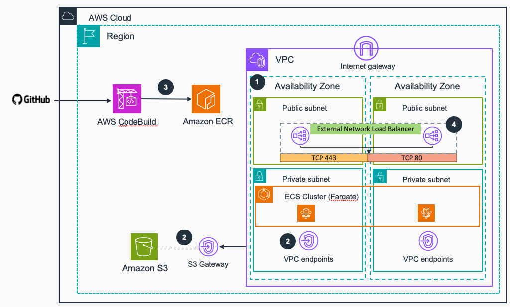
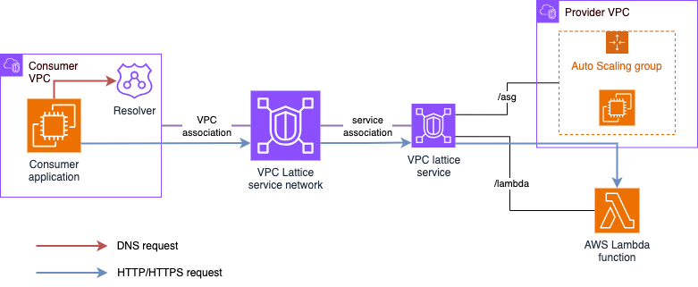
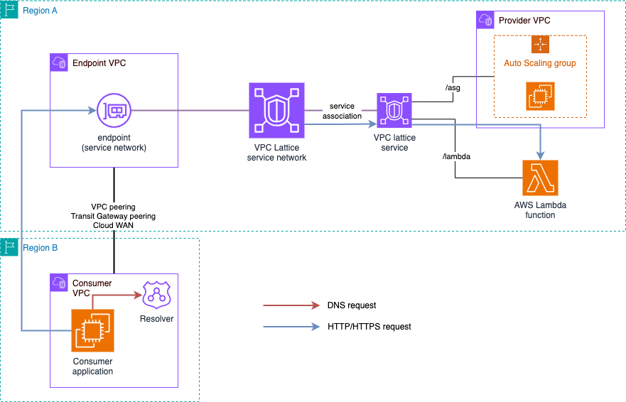
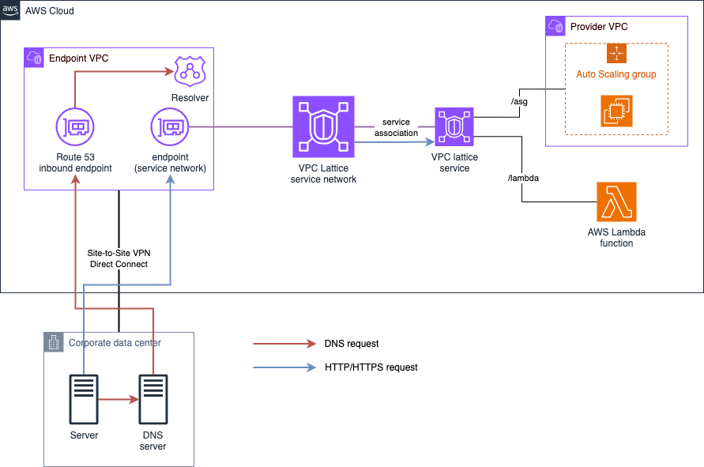

# Guidance for External Connectivity to Amazon VPC Lattice

This Guidance builds a [Serverless](https://aws.amazon.com/serverless/) proxy enabling [Amazon VPC Lattice](https://aws.amazon.com/vpc/lattice/) services to be reached by consumers from non-trusted external locations from AWS.



## Table of Content

- [Guidance for External Connectivity to Amazon VPC Lattice](#guidance-for-external-connectivity-to-amazon-vpc-lattice)
  - [Table of Content](#table-of-content)
  - [Overview](#overview)
    - [Cost](#cost)
  - [Prerequisities](#prerequisities)
    - [Operating System](#operating-system)
    - [Supported AWS Regions](#supported-aws-regions)
    - [VPC Lattice resources](#vpc-lattice-resources)
    - [DNS resolution configuration](#dns-resolution-configuration)
  - [Deployment Steps](#deployment-steps)
  - [Deployment Validation](#deployment-validation)
  - [Running the Guidance](#running-the-guidance)
  - [Next Steps](#next-steps)
    - [Security](#security)
    - [Proxy Configuration](#proxy-configuration)
    - [Scaling](#scaling)
    - [Logging](#logging)
    - [Performance](#performance)
  - [Cleanup](#cleanup)
  - [FAQ, known issues, additional considerations, and limitations](#faq-known-issues-additional-considerations-and-limitations)
    - [Considerations](#considerations)
  - [License](#license)
  - [Contributing](#contributing)
  - [Authors](#authors)

## Overview

When you create a [VPC Lattice service](https://docs.aws.amazon.com/vpc-lattice/latest/ug/services.html), you are given a DNS name that represents it (globally unique and externally resolvable). However, from outside of the VPC, the DNS name resolves to a series of IP addresses in the **169.254.171.x/24** range (within the IPv4 Link-Local range 169.254/16 defined in [RFC3927](https://datatracker.ietf.org/doc/html/rfc3927)) and **fd00:ec2:80::/64** range (within the IPv6 Link-local range fe80::/10 defined in [RFC4291](https://datatracker.ietf.org/doc/html/rfc4291)). Link-Local addresses are not routable and are intended for devices that are connected to the same physical (or logical) link. When a consumer in a VPC resolves a VPC Lattice service to a Link-Local address, packets put on the wire to that address are intercepted by a special function in the [Nitro](https://aws.amazon.com/ec2/nitro/) card and routed to an ingress endpoint for the VPC Lattice service. In the destination VPC, the inverse happens, and VPC Lattice makes the necessary connections to the published VPC Lattice services. This means that external applications won't be able to consume a service exposed via VPC Lattice unless they are deployed in a VPC eitherassociated to the [VPC Lattice service network](https://docs.aws.amazon.com/vpc-lattice/latest/ug/service-networks.html) where they are associated.



With the release of [service network endpoints](https://docs.aws.amazon.com/vpc/latest/privatelink/access-with-service-network-endpoint.html), now you can also place ENIs in a VPC and connect your consumer applications to VPC Lattice service networks from locations outside of the VPC. However, this endpoint works a bit different as the *Interface* endpoint: 

1. Each endpoint can consume multiple /28 IPv4 and /80 IPv6 rangs per Availability Zone (subnet). 
2. From this ranges, several VPC Lattice services may consume and share a single IP address.

Meaning, you cannot guarantee that the IP address to target when consuming a specific VPC Lattice service is the same as another one, and that this IP won't change. That's why per VPC Lattice service associated to a service network, a new globally unique and externally resovable domain name will be created (now resolving to the routable IP from the endpoint's ranges). **For hybrid and cross-Region scenarios**, the service network endpoint is the recommended approach as it will only required the configuration of the corresponding DNS resolution (either hybrid or at the consumer VPC) to target the endpoint.





For the use case of **consumers outside of AWS without private communication**, as new services are added to the environment, IP addresses that are used to connect to them can change. For this reason, it is simpler to harness an ingress proxy layer that can perform dynamic lookups and resolution for your services on your behalf - and that's what this Guidance builds! Without this dynamic layer front-ending your traffic, additional steps would be required to discover endpoint secondary IP address information and dynamically update any static configurations that you have deployed.

### Cost

You are responsible for the cost of the AWS services used while running this Guidance. As of April 2025, the cost for running this Guidance with the default settings in the US East (N. Virginia) is approximately **$185.20 per month**. The following table provides a sample cost breakdown for deploying this Guidance with the default parameters in the US East (N. Virginia) Region for one month.

| AWS service  | Dimensions | Cost [USD] |
| ----------- | ------------ | ------------ |
| [AWS Fargate](https://aws.amazon.com/fargate/pricing/) | 3x2vCPUs & 3x4GBRAM | $ 30.08 month |
| [Network Load Balancer](https://aws.amazon.com/elasticloadbalancing/pricing/) | 1 NLCU & 1 NLB | $ 21.20 month |
| [VPC endpoints](https://aws.amazon.com/privatelink/pricing/) | 6 endpoint types in 3 Availability Zones | $ 133.92 month |

Note that you can cost-optimize this Guidance Solution by reducing the number of Availability Zones to use (by default, 3 are used). We recommend the use of at least 2 Availability Zones to achieve high-availability.

The following AWS services are within the [AWS Free Tier](https://aws.amazon.com/free/). Please check pricing pages to understand cost outside the Free Tier:

* [Amazon Elastic Container Registry](https://aws.amazon.com/ecr/pricing/)
* [AWS CodeBuild](https://aws.amazon.com/codebuild/pricing/)

We recommend creating a [Budget](https://docs.aws.amazon.com/cost-management/latest/userguide/budgets-managing-costs.html) through [AWS Cost Explorer](https://aws.amazon.com/aws-cost-management/aws-cost-explorer/) to help manage costs. Prices are subject to change. For full details, refer to the pricing webpage for each AWS service used in this Guidance.

## Prerequisities

### Operating System

These deployment instructions are optimized to best work on Linux ARM64 instances. As we make use of AWS Fargate as serverless compute solution for containers, you don't need to worry about the instance infrastructure management.

### Supported AWS Regions

* This Guidance is meant to be built in those AWS Regions where Amazon VPC Lattice is supported. To get the list of supported Regions, check the [Amazon VPC Lattice endpoint and quotas](https://docs.aws.amazon.com/general/latest/gr/vpc-lattice-service.html) page.
* Check the supported Regions for the rest of AWS services used in this Guidance. However, consider VPC Lattice as the key one to check, since the rest of services have broader support:
    * The proxy is built using Amazon ECS on AWS Fargate. To get the supported Regions, check the [Amazon ECS documentation](https://docs.aws.amazon.com/AmazonECS/latest/developerguide/AWS_Fargate-Regions.html).
    * [Amazon Elastic Container Registry](https://aws.amazon.com/ecr/) (ECR) is used to store the container images - you can check supported Regions [here](https://docs.aws.amazon.com/general/latest/gr/ecr.html) page.
    * [AWS CodeBuild](https://aws.amazon.com/codebuild/) is used to build and push the container image to Amazon ECR - you can check supported Regions [here](https://docs.aws.amazon.com/general/latest/gr/codebuild.html)

### VPC Lattice infrastructure

* This Guidance provides access to VPC Lattice services, but **it does not create any VPC Lattice assets**. 
* You can provide access to several VPC Lattice service networks from the ingress VPC deployed in this Guidance by using either a [VPC Lattice service network association](https://docs.aws.amazon.com/vpc-lattice/latest/ug/service-network-associations.html) (1 per VPC), or several [VPC Lattice service network endpoints](https://docs.aws.amazon.com/vpc/latest/privatelink/access-with-service-network-endpoint.html). **The Guidance does not create any of these assets**.
  * When using service network endpoints, please check carefully the pre-requisites needed for the subnets where you place them - mainly for IPv4.
* You can use the example in the *vpc-lattice_example* folder (`vpc-lattice_service.yaml`) to test end-to-end service consumption with the Guidance.

### DNS resolution configuration

Once the ingress VPC and proxy is created, and the VPC is associated or VPC endpoint has been created to a VPC Lattice service network, DNS resolution has to be configured to allow connectivity from the external application to the proxy and from the proxy to VPC Lattice. This section covers the DNS resolution configuration needed for the recommended pattern for this Guidance - **consumers outside of AWS without private communication**.

* First, you need a public Route 53 hosted zone to map the [VPC Lattice custom domain name](https://docs.aws.amazon.com/vpc-lattice/latest/ug/service-custom-domain-name.html) into the proxy's [Amazon Network Load Balancer](https://docs.aws.amazon.com/elasticloadbalancing/latest/network/introduction.html) (NLB) domain name (CNAME record).
* Second, a Route 53 private hosted zone that maps the custom domain name to the VPC Lattice service generated domain name. We recommend the creation of an [ALIAS record](https://docs.aws.amazon.com/Route53/latest/DeveloperGuide/resource-record-sets-choosing-alias-non-alias.html). This hosted zone needs to be associated to the ingress VPC. 
  * For VPC Lattice services with a custom domain name under the same private hosted zone name, you won't need new hosted zones.

**NOTE** This Guidance does not create the hosted zones nor configures any DNS resolution. However, you can find an example in the *vpc-lattice_example* folder (`dns-resolution.yaml`).

## Deployment Steps

To deploy this Guidance follow these steps:

1. Deploy the Guidance using the following [stack template](/guidance-stack.yml). 
  * For security reasons, the stack will ask you for an IPv4 (compulsory) and IPv6 (optional) block to allow connectivity to the public-facing NLB. 
  * The VPC IPv4 CIDR block is another parameter you can configure, and it defaults to 192.168.1.0/16.

```
aws cloudformation deploy --template-file ./guidance-stack.yml --stack-name guidance-vpclattice-external --parameter-overrides AllowedIPv4Block={YOUR_IPV4_BLOCK} AllowedIPv6Block={YOUR_IPV6_BLOCK} --capabilities CAPABILITY_IAM
```

The stack deploys the following resources:

* An [Amazon Virtual Private Cloud](https://docs.aws.amazon.com/vpc/latest/userguide/what-is-amazon-vpc.html) across three [Availability Zones](https://aws.amazon.com/about-aws/global-infrastructure/regions_az/) with both public and private subnets across all three. In addition, supporting infrastructure such as:
    * [AWS PrivateLink VPC Endpoints (interface and gateway)](https://docs.aws.amazon.com/whitepapers/latest/aws-privatelink/what-are-vpc-endpoints.html) for the reaching AWS services privately.
    * [Route Tables](https://docs.aws.amazon.com/vpc/latest/userguide/VPC_Route_Tables.html)
    * [Internet Gateway](https://docs.aws.amazon.com/vpc/latest/userguide/VPC_Internet_Gateway.html).
* Internet-facing [Network Load Balancer](https://aws.amazon.com/elasticloadbalancing/network-load-balancer/) (NLB) deployed in the three public subnets - across three Availability Zones.
* Two [Target Groups](https://docs.aws.amazon.com/elasticloadbalancing/latest/network/load-balancer-target-groups.html) that are used to pass traffic to back-end compute instances. 
* [Elastic Container Service Cluster](https://aws.amazon.com/ecs/), [ECS Task Definition](https://docs.aws.amazon.com/AmazonECS/latest/developerguide/task_definitions.html), and an [ECS Service](https://docs.aws.amazon.com/AmazonECS/latest/developerguide/ecs_services.html) using [AWS Fargate](https://aws.amazon.com/fargate/) as the capacity provider. As Fargate tasks are deployed, they are mapped to the load balancer target groups which are bound to two TCP listeners configured for ports 80 and 443.
* The stack also creates the infrastructure needed to build and push the proxy code to a repository that is needed to iterate on your code releases and deploys:
    * Amazon ECR for storing container images.
    * AWS CodeBuild environment for building containers that run an open-source version of [NGINX](https://www.nginx.com/).

**NOTE** When deploying ECS for the first time, a ServiceLink Role is created for you. If you experience a stack deployment failure due to this Role not being created in time, clean the failed stack by deleting it then re-deploying.

2. To consume the VPC Lattice services, you will need to configure DNS resolution.

## Deployment Validation

* Open the AWS CloudFormation console and verify that the stack is deployed without errors.
* Move to the Amazon Elastic Container Service console. A cluster with the name **{STACK_NAME}-NginxCluster-%random%** should have been created with 3 running tasks.

## Running the Guidance

Once the Guidance has been deployed you should be able to perform a simple curl against your network load balancer's public DNS name, or your own DNS alias records that you may have created to masquerade behind. 

```
curl https://yourvpclatticeservice.name
```

If you have enabled your VPC Lattice service or service network for authorization, then you will need to sign your requests to the endpoint in the **same region** that you have deployed the stack in -  the following example using the **--aws-sigv4** switch with curl demonstrates how to do this:

```
curl https://yourvpclatticeservice.name \
    --aws-sigv4 "aws:amz:%region%:vpc-lattice-svcs" \
    --user "$AWS_ACCESS_KEY_ID:$AWS_SECRET_ACCESS_KEY" \
    --header "x-amz-security-token:$AWS_SESSION_TOKEN" \
    --header "x-amz-content-sha256:UNSIGNED-PAYLOAD"
```

You can test this by using the [setcredentials.sh](./scripts/setcredentials.sh) script and the [callendpoint.sh](./scripts/callendpoint.sh) script in this repo.

## Next Steps

### Security

This Guidance uses [PrivateLink Interface Endpoints](https://docs.aws.amazon.com/vpc/latest/privatelink/create-interface-endpoint.html) within the Private Subnets so that [NAT Gateways](https://docs.aws.amazon.com/vpc/latest/userguide/vpc-nat-gateway.html) are not required to reach the ECS Services. In addition, a [Security Group](https://docs.aws.amazon.com/elasticloadbalancing/latest/network/load-balancer-security-groups.html) is configured in the the NLB to control traffic from allowed resources outside of the VPC.

### Proxy Configuration

The NGINX proxy image is built by CodeBuild when you deploy the resources for the first time. We recommend to include the code in your own repository and pipeline if you wish to commit changes to it.

The NGINX configuration file - [nginx.conf](/Dockerfiles/nginx/nginx.conf) - is configured (as part of this repo) in the following way:

```
load_module /usr/lib64/nginx/modules/ngx_stream_module.so;
```

This loads the tcp streaming module for tls based passthrough.

The stream listener reads the SNI header to understand where the traffic is destined to, it uses the Amazon provided DNS endpoint at `169.254.169.253` for resolution which supplies a zonal response for the VPC Lattice service. The downstream endpoint is reached using the following directive `proxy_pass $ssl_preread_server_name:$server_port`

```
server {
    listen 443 proxy_protocol;
    proxy_pass $ssl_preread_server_name:$server_port;
    ssl_preread on;
    set_real_ip_from 192.168.0.0/16;
}
```
Proxy protocol is configured thus `listen 443 proxy_protocol`. This configuration trusts the NLB to pass **true** source IP information to the NGINX proxy `set_real_ip_from 192.168.0.0/16`.

Logging is output directly to Amazon CloudWatch Logs group for each Fargate Task:

```
log_format  basic   '$time_iso8601 $remote_addr $proxy_protocol_addr $proxy_protocol_port $protocol $server_port '
                '$status $upstream_addr $upstream_bytes_sent $upstream_bytes_received $session_time  $upstream_connect_time';

access_log  /var/log/nginx/stream_access.log basic if=$notAHealthCheck;
error_log   /var/log/nginx/stream_error.log crit;

```

This handy logic entry removes unnecessary health-check information from the logs:

```
map $bytes_received $notAHealthCheck {
    "~0"            0;
    default         1;
}
```
The http module is configured in a similar fashion to the stream module, except this proxies the http connection between the NLB and the VPC Lattice service -  passing the Host header and setting the upstream http version.

```
server {
    listen 80 proxy_protocol;
    location / {
        proxy_set_header Host $host;
        proxy_pass  http://$host:80;
        proxy_http_version 1.1;
    }
    set_real_ip_from 192.168.0.0/16;
    real_ip_header proxy_protocol;
}
```

### Scaling

This Guidance has been built on the assumption that it should automatically scale and contract using average CPU metrics for the ECS Service as the dimension. During load-testing, it was evident that the Guidance was CPU bound as the load increased, based on the specifications of the task sizes that were chosen - some independent measurement statistics can be found [here](https://www.stormforge.io/blog/aws-fargate-network-performance/). You can adjust this by using a metric that best suits your application profile and load simply by modifying the [cluster.yaml](/cloudformation/ecs/cluster.yaml) template. 

Using [Application Autoscaling](https://docs.aws.amazon.com/autoscaling/application/userguide/services-that-can-integrate-ecs.html) with ECS, you can use both TargetTrackingScaling and StepScaling. This Guidance uses TargetTrackingScaling and a `PredefinedMetricType` of `ECSServiceAverageCPUUtilization` - but you can write your own metrics, publish them to CloudWatch and then reference these using a `CustomizedMetricSpecification`, more details on that [here](https://docs.aws.amazon.com/AWSCloudFormation/latest/UserGuide/aws-properties-applicationautoscaling-scalingpolicy-targettrackingscalingpolicyconfiguration.html#cfn-applicationautoscaling-scalingpolicy-targettrackingscalingpolicyconfiguration-customizedmetricspecification)

This Guidance assumes that you want to scale when the service reaches an average cpu utilisation of `70%` - to modify this, simply adjust the template.

```
  NginxScalableTarget:
    Type: AWS::ApplicationAutoScaling::ScalableTarget
    Properties: 
      MaxCapacity: 9
      MinCapacity: 3
```

```
  NginxScalingPolicy:
    Type: AWS::ApplicationAutoScaling::ScalingPolicy
    Properties: 
      .....
      TargetTrackingScalingPolicyConfiguration:
        TargetValue: 70.0
        ScaleInCooldown: 60
        ScaleOutCooldown: 60
```

### Logging

This Guidance makes use of [Container Insights](https://docs.aws.amazon.com/AmazonCloudWatch/latest/monitoring/ContainerInsights.html) for capturing performance data for the ECS service. This data is written into Amazon CloudWatch Logs and can be accessed from the ECS or CloudWatch console.


### Performance

A level of testing was performed against the Guidance. The specifics of the testing were as follows:

* Region tested us-west-2
* The Amazon VPC Lattice Service Published was [AWS Lambda](https://aws.amazon.com/lambda/)
    * This was a simple Lambda function, that had concurrency elevated to 3000 (from 1000 base)
* External access via a three-zone AWS Network Load Balancer using DNS for round-robin on requests
* AWS NLB was not configured for X-zone load balancing (in tests, this performed less well)
* Three zonal AWS Fargate Tasks bound to the Network Load Balancer
    * Each task had 2048 CPU units and 4096MB RAM

The testing harness used came from an AWS Solution that can be found [here](https://aws.amazon.com/solutions/implementations/distributed-load-testing-on-aws/) and additionally, the template can be found in this repo, [here](/load-test/distributed-load-testing-on-aws.template).

The following results show the harness performance, NLB performance, VPC Lattice performance and LAMBDA performance given 5000 remote users, generating ~3000 requests per second, with sustained access for 20 mins and a ramp-up time of 5 minutes.

**Harness Performance**


**ECS Performance**


**LAMBDA Performance**


**VPC Lattice Performance**


## Cleanup

1. Remove the stack created at deployment.

**NOTE** The ECR repo will remain and should be removed manually.

## FAQ, known issues, additional considerations, and limitations

### Considerations

For this Guidance, we consider the following design elements and constraints:

* The Guidance will provide layer 4 connectivity and layer 3 security. We are leaving all the layer 7 management to VPC Lattice. 
* VPC Lattice will provide authentication and authorization. The VPC Lattice service network and/or services should continue to function with authN/Z policies defined against them to ensure principals are who they say they are, and their actions are permitted.
* The Guidance will make use of a fleet of lightweight open-source NGINX proxies running as ECS tasks. The entry point to this fleet will be an external NLB.
* The Guidance will perform TCP-proxying for TLS connections and pass through connections to VPC Lattice (avoids certificate management between the provider and ingress provider) reading SNI fields for dynamic endpoint lookup.
* The Guidance will perform HTTP proxying for non-TLS connections by reading host header fields for dynamic endpoint lookup.
* The recommended and common pattern when creating a VPC Lattice service is to use custom domains. Therefore, now we can make use of several Route 53 hosted zones to have a different DNS resolution depending the location of the consumer (external users or the proxy).

## License

This library is licensed under the MIT-0 License. See the [LICENSE](LICENSE) file.

## Contributing

See [CONTRIBUTING](CONTRIBUTING.md) for more information.

## Authors

* Pablo Sánchez Carmona, Senior Network Specialist Solutions Architect, AWS
* Adam Palmer, Principal TPM, Kuiper
