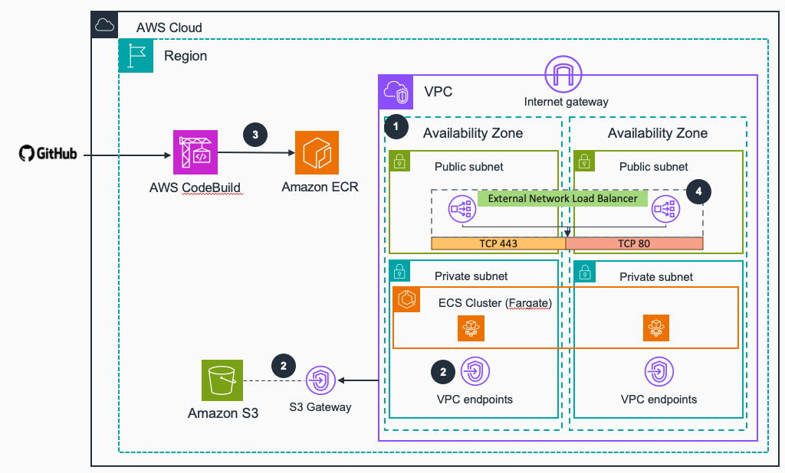
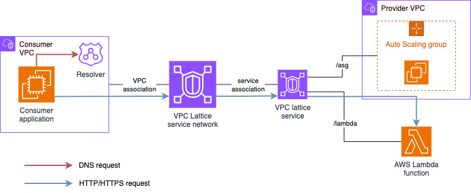
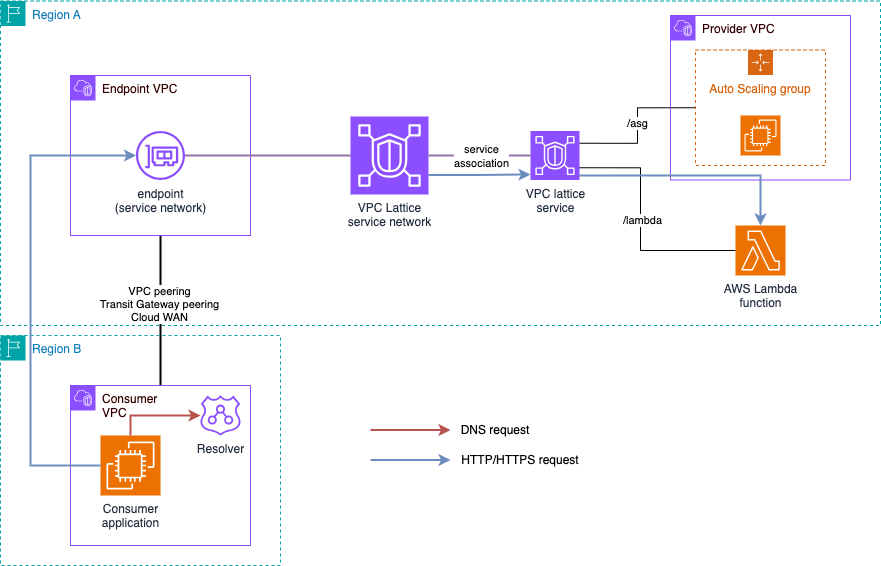
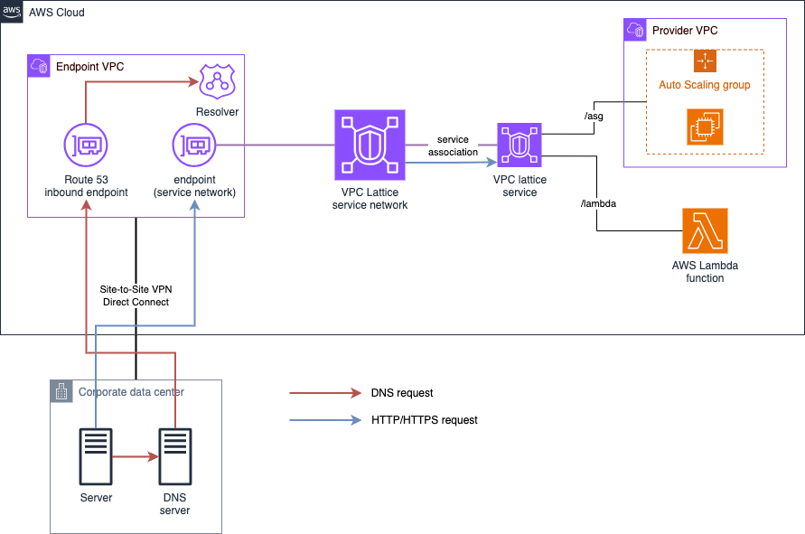

# Guidance for External Connectivity to Amazon VPC Lattice

This Guidance builds a [serverless](https://aws.amazon.com/serverless/) proxy that lets clients **outside AWS** reach your [Amazon VPC Lattice](https://aws.amazon.com/vpc/lattice/) services.



## Table of Content

- [Guidance for External Connectivity to Amazon VPC Lattice](#guidance-for-external-connectivity-to-amazon-vpc-lattice)
  - [Table of Content](#table-of-content)
  - [Overview](#overview)
    - [Proxy engines](#proxy-engines)
    - [Cost](#cost)
  - [Prerequisites](#prerequisites)
    - [Operating System](#operating-system)
    - [Supported AWS Regions](#supported-aws-regions)
    - [VPC Lattice infrastructure](#vpc-lattice-infrastructure)
    - [DNS resolution configuration](#dns-resolution-configuration)
  - [Deployment Steps](#deployment-steps)
  - [Deployment Validation](#deployment-validation)
  - [Running the Guidance](#running-the-guidance)
  - [Cleanup](#cleanup)
  - [Next Steps](#next-steps)
    - [Security](#security)
    - [Scaling](#scaling)
    - [Logging](#logging)
    - [Performance](#performance)
  - [FAQ, known issues, additional considerations, and limitations](#faq-known-issues-additional-considerations-and-limitations)
    - [Considerations](#considerations)
  - [License](#license)
  - [Contributing](#contributing)
  - [Authors](#authors)

## Overview

A VPC Lattice service gets a globally resolvable DNS name, but outside its VPC that name resolves to **link-local IPs** (`169.254.171.x/24` within the IPv4 link-local range of [RFC3927](https://datatracker.ietf.org/doc/html/rfc3927), and `fd00:ec2:80::/64` within the IPv6 link-local range of [RFC4291](https://datatracker.ietf.org/doc/html/rfc4291)). Link-local addresses aren't routable. When a consumer inside an associated VPC resolves the service, the [Nitro](https://aws.amazon.com/ec2/nitro/) card intercepts the packets and routes them to the [VPC Lattice service network](https://docs.aws.amazon.com/vpc-lattice/latest/ug/service-networks.html) ingress. So a client **outside** such a VPC can't connect directly.



[Service network endpoints](https://docs.aws.amazon.com/vpc/latest/privatelink/access-with-service-network-endpoint.html) let you place ENIs in a VPC and reach service networks from outside it. They behave differently from *Interface* endpoints:

1. Each endpoint consumes multiple /28 IPv4 and /80 IPv6 ranges per Availability Zone (subnet).
2. Several VPC Lattice services can share a single IP from those ranges.

So you can't assume a service's IP is stable or unique. To handle this, each service associated to the network gets its own globally unique, externally resolvable domain name (resolving to a routable endpoint IP). **For hybrid and cross-Region access**, service network endpoints are the recommended approach: you only configure the matching DNS resolution (hybrid or in the consumer VPC) to target the endpoint.





**For clients outside AWS with no private connectivity**, the IPs used to reach services can change as services are added. This Guidance front-ends VPC Lattice with a proxy layer that resolves services dynamically on each request, so a changing backend IP never breaks your clients, and you avoid discovering endpoint IPs and updating static configuration yourself.

### Proxy engines

The proxy runs as a fleet of containers on ECS/Fargate. You choose the engine at deploy time with the `ProxyEngine` parameter (default `nginx`); both perform the same TLS passthrough, so the surrounding infrastructure is identical. Pick based on how much you expect to extend the proxy.

| Engine | `ProxyEngine` | Choose it when |
|---|---|---|
| **NGINX** | `nginx` *(default)* | You want the simplest, smallest TLS-passthrough proxy, just external reach to VPC Lattice. |
| **Envoy** | `envoy` | You expect to grow past plain passthrough (L7 routing, gRPC, richer observability, xDS) and want that data plane as your baseline. |

For how each engine works, how it's built, and how to edit it after deployment, see [`proxies/`](/proxies/).

### Cost

You are responsible for the cost of the AWS services used while running this Guidance. As of May 2026, running it with default settings in US East (N. Virginia) costs approximately **$185.20 per month**, broken down below. This is an estimate of the steady-state (idle) cost; verify for your Region and usage with the [AWS Pricing Calculator](https://calculator.aws/).

| AWS service  | Dimensions | Cost [USD] |
| ----------- | ------------ | ------------ |
| [AWS Fargate](https://aws.amazon.com/fargate/pricing/) | 3x2vCPUs & 3x4GBRAM | $ 30.08 month |
| [Network Load Balancer](https://aws.amazon.com/elasticloadbalancing/pricing/) | 1 NLCU & 1 NLB | $ 21.20 month |
| [VPC endpoints](https://aws.amazon.com/privatelink/pricing/) | 6 endpoint types in 3 Availability Zones | $ 133.92 month |

You can reduce cost by using fewer Availability Zones (default is 3). We recommend at least 2 for high availability.

The CI/CD services typically stay within the [AWS Free Tier](https://aws.amazon.com/free/) at this Guidance's scale; review each pricing page for usage beyond it:

* [Amazon ECR](https://aws.amazon.com/ecr/pricing/) and [AWS CodeBuild](https://aws.amazon.com/codebuild/pricing/): pay-as-you-go for image storage and build minutes.
* [AWS CodePipeline](https://aws.amazon.com/codepipeline/pricing/): one V1 active pipeline is free; the pipeline's S3 artifacts cost a few cents per month.
* [AWS CodeCommit](https://aws.amazon.com/codecommit/pricing/): 5 active users per month are free. Note that the CodePipeline and CodeBuild service roles count as active users, so large teams editing the proxy could exceed the free allowance ($1.00 per additional active user per month).

We recommend creating a [Budget](https://docs.aws.amazon.com/cost-management/latest/userguide/budgets-managing-costs.html) via [AWS Cost Explorer](https://aws.amazon.com/aws-cost-management/aws-cost-explorer/) to manage costs. Prices are subject to change; see each service's pricing page for details.

## Prerequisites

### Operating System

These instructions are optimized for Linux ARM64. Because the proxy runs on AWS Fargate (serverless), you don't manage any instance infrastructure.

### Supported AWS Regions

Deploy this Guidance in any Region where **Amazon VPC Lattice** is available (it's the gating service). The other services have broader Region support.

| Service | Region availability |
|---|---|
| Amazon VPC Lattice | [endpoints & quotas](https://docs.aws.amazon.com/general/latest/gr/vpc-lattice-service.html) |
| Amazon ECS on AWS Fargate | [supported Regions](https://docs.aws.amazon.com/AmazonECS/latest/developerguide/AWS_Fargate-Regions.html) |
| Amazon ECR | [supported Regions](https://docs.aws.amazon.com/general/latest/gr/ecr.html) |
| AWS CodeBuild | [supported Regions](https://docs.aws.amazon.com/general/latest/gr/codebuild.html) |
| AWS CodePipeline | [supported Regions](https://docs.aws.amazon.com/general/latest/gr/codepipeline.html) |
| AWS CodeCommit | [supported Regions](https://docs.aws.amazon.com/general/latest/gr/codecommit.html) |

### VPC Lattice infrastructure

This Guidance provides *access* to VPC Lattice services but **does not create any VPC Lattice assets**. You connect the ingress VPC to one or more service networks using either:

* a [service network VPC association](https://docs.aws.amazon.com/vpc-lattice/latest/ug/service-network-associations.html) (1 per VPC), or
* one or more [service network VPC endpoints](https://docs.aws.amazon.com/vpc/latest/privatelink/access-with-service-network-endpoint.html) (check the subnet prerequisites carefully, mainly for IPv4).

To test end-to-end consumption, use the templates in the [vpc-lattice_example](/vpc-lattice_example/) folder.

### DNS resolution configuration

After the ingress VPC and proxy are created and the VPC is associated (or an endpoint created) to a service network, configure DNS so external clients reach the proxy and the proxy reaches VPC Lattice. You need two records:

* A **public** Route 53 record mapping the [VPC Lattice custom domain name](https://docs.aws.amazon.com/vpc-lattice/latest/ug/service-custom-domain-name.html) to the proxy's [NLB](https://docs.aws.amazon.com/elasticloadbalancing/latest/network/introduction.html) DNS name.
* A **private** Route 53 record (in a hosted zone associated to the ingress VPC) mapping the custom domain name to the VPC Lattice-generated domain name. Services sharing a domain name under the same private hosted zone name don't need new zones.

For both records, we recommend an [ALIAS record](https://docs.aws.amazon.com/Route53/latest/DeveloperGuide/resource-record-sets-choosing-alias-non-alias.html).

**NOTE** This Guidance does not create hosted zones or configure DNS. See [dns-resolution.yml](/vpc-lattice_example/dns-resolution.yml) in the [vpc-lattice_example](/vpc-lattice_example/) folder for an example.

## Deployment Steps

1. Deploy the [stack template](/guidance-stack.yml). Key parameters:
   * `AllowedIPv4Block` (required) and `AllowedIPv6Block` (optional): CIDR blocks allowed to reach the public NLB.
   * `VpcCidr`: VPC IPv4 CIDR, defaults to `192.168.1.0/16`.
   * `ProxyEngine`: proxy engine to deploy, `nginx` (default) or `envoy` (see [Proxy engines](#proxy-engines)).

```
aws cloudformation deploy --template-file ./guidance-stack.yml --stack-name guidance-vpclattice-external --parameter-overrides AllowedIPv4Block={YOUR_IPV4_BLOCK} AllowedIPv6Block={YOUR_IPV6_BLOCK} ProxyEngine=nginx --capabilities CAPABILITY_IAM
```

The stack deploys three layers: the network path, the proxy that serves traffic, and a CI/CD pipeline to iterate on the proxy. The **Lifecycle** column shows what runs continuously, what only runs on demand, and what is kept when the stack is deleted:

| Layer | Resources | Lifecycle |
|---|---|---|
| **Networking** | [VPC](https://docs.aws.amazon.com/vpc/latest/userguide/what-is-amazon-vpc.html) across 3 AZs (public/private/endpoint subnets, [route tables](https://docs.aws.amazon.com/vpc/latest/userguide/VPC_Route_Tables.html), [Internet Gateway](https://docs.aws.amazon.com/vpc/latest/userguide/VPC_Internet_Gateway.html)) and [PrivateLink endpoints](https://docs.aws.amazon.com/whitepapers/latest/aws-privatelink/what-are-vpc-endpoints.html) (so Fargate needs no NAT) | 🟢 Always on · deleted with stack |
| **Ingress** | Internet-facing dualstack [NLB](https://aws.amazon.com/elasticloadbalancing/network-load-balancer/) + target group on a single **port-443** TCP listener (TLS-only; add HTTP via [customizations/](/customizations/)) | 🟢 Always on · deleted with stack |
| **Ingress** | [ECS](https://aws.amazon.com/ecs/) [service](https://docs.aws.amazon.com/AmazonECS/latest/developerguide/ecs_services.html) on [AWS Fargate](https://aws.amazon.com/fargate/) running the proxy, with [Application Auto Scaling](https://docs.aws.amazon.com/autoscaling/application/userguide/what-is-application-auto-scaling.html) on CPU and [CloudWatch](https://aws.amazon.com/cloudwatch/) logs / Container Insights | 🟢 Always on · deleted with stack |
| **CI/CD** | [CodePipeline](https://aws.amazon.com/codepipeline/) (Source → Build → Deploy) with [CodeBuild](https://aws.amazon.com/codebuild/), triggered by an [EventBridge](https://aws.amazon.com/eventbridge/) rule on each commit (plus their [IAM](https://aws.amazon.com/iam/) roles; hence `CAPABILITY_IAM`) | 🟡 Runs on commit only, not in the traffic path · deleted with stack |
| **CI/CD** | One-time bootstrap: an [AWS Lambda](https://aws.amazon.com/lambda/) custom resource and a bootstrap CodeBuild project (and their roles) that seed CodeCommit and build the first image | ⚪ Used once at creation, then idle (no ongoing cost) · removed on stack deletion |
| **CI/CD** | [ECR](https://aws.amazon.com/ecr/) repository (scan-on-push), [CodeCommit](https://docs.aws.amazon.com/codecommit/latest/userguide/welcome.html) repository (the editable proxy source, seeded once from `SourceRepoUrl`/`ProxyEngine`), and the [S3](https://aws.amazon.com/s3/) artifact bucket | 🔒 **Retained on deletion** so images and customizations survive (see [Cleanup](#cleanup)) |

**NOTE** On first-time ECS use, a service-linked role is created for you. If the stack fails because the role wasn't created in time, delete the failed stack and redeploy.

2. Configure DNS resolution so clients can consume the VPC Lattice services (see above).

## Deployment Validation

* In the AWS CloudFormation console, confirm the stack deployed without errors.
* In the Amazon ECS console, confirm the cluster **{STACK_NAME}-ProxyCluster-%random%** has 3 running tasks.

## Running the Guidance

Once deployed, curl your NLB's DNS name (or your own alias record):

```
curl https://yourvpclatticeservice.name
```

If your VPC Lattice service or service network has authorization enabled, sign requests in the **same Region** you deployed the stack. This example uses curl's **--aws-sigv4** flag:

```
curl https://yourvpclatticeservice.name \
    --aws-sigv4 "aws:amz:%region%:vpc-lattice-svcs" \
    --user "$AWS_ACCESS_KEY_ID:$AWS_SECRET_ACCESS_KEY" \
    --header "x-amz-security-token:$AWS_SESSION_TOKEN" \
    --header "x-amz-content-sha256:UNSIGNED-PAYLOAD"
```

You can test this with the [setcredentials.sh](./scripts/setcredentials.sh) and [callendpoint.sh](./scripts/callendpoint.sh) scripts in this repo.

## Cleanup

1. **Delete the stack**. This removes everything except the three retained resources below.

```
aws cloudformation delete-stack --stack-name guidance-vpclattice-external --region {YOUR_REGION}
```

2. **Manually remove the retained resources** if you no longer need them. These are kept on purpose so a stack deletion never destroys your images or customizations:

| Resource | Why it's retained | Deleting it means |
|---|---|---|
| ECR repository | Holds your proxy container images | Losing all built images |
| CodeCommit repository | Holds your committed proxy customizations | **Losing your proxy source edits** |
| S3 artifact bucket | Holds pipeline artifacts | Losing pipeline run history |

> ⚠️ Deleting the CodeCommit repository is irreversible and removes any proxy changes you committed. Clone or back it up first if you might redeploy later.

## Next Steps

### Security

The proxy runs in private subnets and reaches AWS services through [PrivateLink interface endpoints](https://docs.aws.amazon.com/vpc/latest/privatelink/create-interface-endpoint.html), so no [NAT gateways](https://docs.aws.amazon.com/vpc/latest/userguide/vpc-nat-gateway.html) are needed. A [security group](https://docs.aws.amazon.com/elasticloadbalancing/latest/network/load-balancer-security-groups.html) on the NLB restricts inbound traffic to your allowed CIDR blocks.

Because this is **external** connectivity over the public internet, the Guidance is **TLS-only by default**: the proxy exposes only port 443 and does TLS passthrough (reading the SNI without decrypting), keeping traffic encrypted end-to-end to the VPC Lattice service. Enforce HTTPS on your VPC Lattice services accordingly (an HTTPS listener with a certificate and custom domain). Port 80 is intentionally not exposed; if you need it, [customizations/](/customizations/) shows how to add it back with the relevant caveats.

### Scaling

The ECS service autoscales on average CPU. Under load testing the proxy was CPU-bound at the chosen task sizes (see these [independent measurements](https://www.stormforge.io/blog/aws-fargate-network-performance/)). Adjust the metric to fit your workload by editing [guidance-stack.yml](/guidance-stack.yml).

This Guidance uses [Application Auto Scaling](https://docs.aws.amazon.com/autoscaling/application/userguide/services-that-can-integrate-ecs.html) target tracking with the `ECSServiceAverageCPUUtilization` predefined metric. You can swap in your own metric via a [`CustomizedMetricSpecification`](https://docs.aws.amazon.com/AWSCloudFormation/latest/UserGuide/aws-properties-applicationautoscaling-scalingpolicy-targettrackingscalingpolicyconfiguration.html#cfn-applicationautoscaling-scalingpolicy-targettrackingscalingpolicyconfiguration-customizedmetricspecification). The default target is **70%** CPU; adjust it in the template:

```
  NginxScalableTarget:
    Type: AWS::ApplicationAutoScaling::ScalableTarget
    Properties: 
      MaxCapacity: 9
      MinCapacity: 3
```

```
  NginxScalingPolicy:
    Type: AWS::ApplicationAutoScaling::ScalingPolicy
    Properties: 
      .....
      TargetTrackingScalingPolicyConfiguration:
        TargetValue: 70.0
        ScaleInCooldown: 60
        ScaleOutCooldown: 60
```

### Logging

The ECS service uses [Container Insights](https://docs.aws.amazon.com/AmazonCloudWatch/latest/monitoring/ContainerInsights.html) to capture performance data, written to CloudWatch Logs and viewable from the ECS or CloudWatch console.


### Performance

We load-tested the Guidance against an [AWS Lambda](https://aws.amazon.com/lambda/) VPC Lattice service (concurrency raised to 3000 from the 1000 base), driving 5000 remote users at ~3000 requests/second for 20 minutes with a 5-minute ramp-up. The test setup:

| Setting | Value |
|---|---|
| Region | us-west-2 |
| Ingress | Three-zone NLB, DNS round-robin, cross-zone balancing **off** (it performed worse in tests) |
| Proxy | Three zonal Fargate tasks, 2048 CPU / 4096 MB each |

The harness is the [Distributed Load Testing on AWS](https://aws.amazon.com/solutions/implementations/distributed-load-testing-on-aws/) solution; its template is also [in this repo](/load-test/distributed-load-testing-on-aws.template). Results below cover harness, NLB, VPC Lattice, and Lambda performance.

**Harness Performance**


**ECS Performance**


**LAMBDA Performance**


**VPC Lattice Performance**


## FAQ, known issues, additional considerations, and limitations

### Considerations

The proxy deliberately handles only **layer 4 connectivity and layer 3 security**, leaving all layer 7 concerns (including authentication and authorization) to VPC Lattice, so you should keep your service network and service authN/Z policies in place. It runs as a fleet of lightweight open-source proxy tasks (NGINX or Envoy; see [Proxy engines](#proxy-engines)) on ECS behind an external NLB, TCP-proxying TLS connections by passthrough and using the SNI for dynamic endpoint lookup, which means no certificates are managed between the provider and the proxy. HTTP proxying is available only as an opt-in [customization](/customizations/) and is not recommended for external exposure. VPC Lattice services commonly use custom domains, which lets you use separate Route 53 hosted zones for different consumers (external users vs. the proxy).

## License

This library is licensed under the MIT-0 License. See the [LICENSE](LICENSE) file.

## Contributing

See [CONTRIBUTING](CONTRIBUTING.md) for more information.

## Authors

* Pablo Sánchez Carmona, Senior Network Specialist Solutions Architect, AWS
* Adam Palmer, Principal TPM, Kuiper
